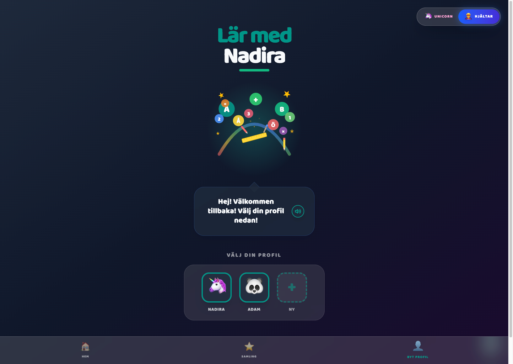
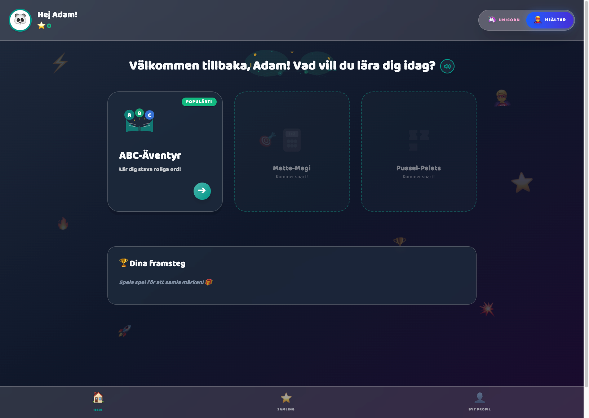

# 🦄 Lär med Nadira

<div align="center">


**En rolig, svenskspråkig lärapp för barn i åldern 6–9 år**

[Demo](https://nadira.mithawala.com) • [Rapportera Bug](https://github.com/asifma/lar-med-nadira/issues) • [Föreslå Feature](https://github.com/asifma/lar-med-nadira/issues)

</div>

---

## 📸 Skärmdumpar

<div align="center">

| Enhörningsvärlden 🦄 | Hjältevärlden 🦸 |
|:---:|:---:|
|  |  |
|  |  |

</div>

---

## 🌟 Vision

**Lärande ska vara gratis, tillgängligt och roligt för alla barn.**

Jag tror på att demokratisera lärande. Varje barn, oavsett bakgrund eller ekonomiska förutsättningar, förtjänar tillgång till högkvalitativa läromedel. Lär med Nadira är mitt bidrag till denna vision – en helt gratis, reklamfri och säker lärapp som hjälper barn att utveckla sina språkkunskaper genom lek.

Appen är byggd med öppen källkod för att möjliggöra för lärare, föräldrar och utvecklare att bidra, anpassa och förbättra upplevelsen för barn över hela världen.

---

## ✨ Funktioner

### 🎮 Interaktiva Spel
- **ABC-Äventyr**: 20 progressiva nivåer för stavningsträning
  - Nybörjare (nivå 1-5): Korta ord med full hjälp
  - Mellannivå (nivå 6-10): Medellånga ord
  - Utmanare (nivå 11-14): Längre ord med ledtrådar
  - Mästare (nivå 15-20): Avancerade ord utan hjälp
  - Svenskt tangentbord med Å, Ä, Ö
  - Text-till-tal för alla ord och instruktioner
  
- **Matte-Magi**: 20 nivåer med visuell matematik
  - Addition (nivå 1-5): 1+1 upp till 18+10
  - Subtraktion (nivå 6-10): 2-1 upp till 20-5
  - Multiplikation (nivå 11-15): 1×1 upp till 10×10
  - Division (nivå 16-20): 2÷1 upp till 120÷10
  - Visuella representationer med emojis
  - Statiska problem anpassade för 6-9 år
  
- **Minnes-Mästaren**: 20 nivåer memory-spel
  - Djur (nivå 1-5): Hitta djurpar
  - Frukt (nivå 6-10): Fruktiga par
  - Fordon (nivå 11-15): Transportpar
  - Blandat (nivå 16-20): Allt möjligt
  - Progressiv svårighetsgrad (4-16 par)
  - Streak-system och animationer

### ⭐ Stjärnsystem
- Få 1-3 stjärnor baserat på första försökets noggrannhet
- Samla klistermärken för varje avklarad nivå
- Spåra framsteg över tid

### 🎨 Två Magiska Teman
- **Enhörningsvärlden** 🦄: Pastellfärger och magisk atmosfär
- **Hjältevärlden** 🦸: Modig och äventyrlig design
- Animerade bakgrundselement
- Tema-anpassade färger och effekter

### 👤 Profilhantering
- Flera barnprofiler per enhet
- 24 roliga avatarer att välja mellan
- Individuell framstegsspårning
- Märkessamling för varje nivå

### 🔒 Säkerhet & Integritet
- **Ingen datainsamling**: All data sparas lokalt
- **Inga annonser**: 100% reklamfri upplevelse
- **PIN-skyddad admin**: Föräldrakontroll
- **Offline-först**: Fungerar utan internetanslutning

### 📊 Föräldrafunktioner
- Framstegsspårning per barn
- Anpassningsbara inställningar
- Rösthastighetskontroll
- Lås upp alla nivåer för testning

---

## 🚀 Kom Igång

### Förutsättningar
- Node.js 18+ 
- npm eller yarn

### Installation

```bash
# Klona repot
git clone https://github.com/asifma/lar-med-nadira.git

# Gå in i projektkatalogen
cd lar-med-nadira

# Installera beroenden
npm install

# Starta utvecklingsservern
npm run dev
```

Appen körs nu på `http://localhost:3000`

### Bygga för Produktion

```bash
# Bygg appen
npm run build

# Förhandsgranska produktionsbygget
npm run preview
```

---

## 🏗️ Teknisk Stack

- **Frontend**: React 19.2 + TypeScript
- **Styling**: Tailwind CSS 4.2
- **Routing**: React Router 7
- **Build Tool**: Vite 6.2
- **PWA**: Service Worker för offline-stöd
- **Speech**: Web Speech API

---

## 📁 Projektstruktur

```
lar-med-nadira/
├── docs/screenshots/    # Skärmdumpar
├── public/              # Statiska filer (ikoner, manifest)
├── src/
│   ├── components/      # Återanvändbara komponenter
│   │   ├── Button.tsx
│   │   ├── ConfirmDialog.tsx
│   │   ├── SpeakableText.tsx
│   │   └── ...
│   ├── contexts/        # React Context providers
│   │   ├── ProfileContext.tsx
│   │   ├── ThemeContext.tsx
│   │   ├── SpeechContext.tsx
│   │   └── SettingsContext.tsx
│   ├── data/           # Speldata och ordlistor
│   │   └── abcWords.ts
│   ├── pages/          # Sidkomponenter
│   │   ├── Dashboard.tsx
│   │   ├── SpellingGame.tsx
│   │   ├── ProfileWizard.tsx
│   │   └── ...
│   ├── types.ts        # TypeScript typdefinitioner
│   ├── index.css       # Globala stilar och teman
│   └── App.tsx         # Huvudkomponent
├── index.html
├── vite.config.ts
└── package.json
```

---

## 🤝 Bidra

Jag välkomnar bidrag från alla! Oavsett om du är lärare, förälder, designer eller utvecklare – din input är värdefull.

### 🎮 Lägg till ett nytt spel (5 minuter!)

Tack vare vår standardiserade struktur är det superenkelt att lägga till nya spel:

**⚡ Snabbstart**: [docs/QUICK_START_NEW_GAME.md](docs/QUICK_START_NEW_GAME.md) - Lägg till ett spel på 5 minuter!

**📚 Mer resurser:**
- [Detaljerad guide](docs/ADDING_GAMES.md) - Komplett guide med alla detaljer
- [Spelmall](docs/GAME_TEMPLATE.md) - Kopiera och anpassa
- [Checklista](docs/NEW_GAME_CHECKLIST.md) - Glöm inget
- [Arkitektur](docs/ARCHITECTURE.md) - Förstå systemet
- [Före/Efter](docs/BEFORE_AFTER_COMPARISON.md) - Se förbättringarna

**🎯 Exempel**: Memory-spelet lades till på 5 minuter med bara 265 rader kod!

**5 enkla steg:**
1. Skapa speldata i `src/data/`
2. Skapa spelkomponent i `src/pages/`
3. Lägg till illustration
4. Registrera i `src/data/gameRegistry.ts`
5. Lägg till route i `src/App.tsx`

**Klart!** Dashboard och samlingssidan uppdateras automatiskt.

### Hur du kan bidra

#### 🎮 Lägg till nya spel
Vill du skapa ett nytt spel? Fantastiskt! Följ dessa steg:

1. Skapa en ny fil i `src/data/` (t.ex. `mathGame.ts`)
2. Definiera spelets struktur enligt `GameDefinition` typen
3. Lägg till spelkortet i `Dashboard.tsx`
4. Skapa spelkomponenten i `src/pages/`
5. Testa grundligt med barn i målgruppen

#### 📝 Förbättra ordlistor
- Lägg till fler ord i `src/data/abcWords.ts`
- Föreslå bättre emoji-representationer
- Skapa tematiska ordlistor (djur, mat, etc.)

#### 🎨 Design & UX
- Föreslå nya teman
- Förbättra animationer
- Skapa nya avatarer
- Designa märken och belöningar

#### 🐛 Rapportera buggar
Hittade du en bugg? [Skapa en issue](https://github.com/asifma/lar-med-nadira/issues) med:
- Beskrivning av problemet
- Steg för att återskapa
- Förväntad vs faktisk beteende
- Skärmdumpar (om relevant)

### Pull Request Process

1. **Forka** repot
2. **Skapa en branch**: `git checkout -b feature/amazing-feature`
3. **Gör dina ändringar** och testa noga
4. **Commit**: `git commit -m 'Add amazing feature'`
5. **Push**: `git push origin feature/amazing-feature`
6. **Öppna en Pull Request** med vår [PR template](.github/PULL_REQUEST_TEMPLATE.md)

Se [CONTRIBUTING.md](CONTRIBUTING.md) för detaljerade riktlinjer.

---

## 📋 Roadmap

### Version 1.1 (Klar) ✅
- [x] Matte-Magi spel (addition, subtraktion, multiplikation, division)
- [x] Minnes-Mästaren spel (memory-spel med olika teman)
- [x] Standardiserad spelstruktur för enkla bidrag
- [x] Stjärnsystem baserat på första försökets noggrannhet
- [x] Visuella framstegskort på dashboard
- [x] Mute-knapp i alla spel

### Version 1.2 (Planerad)
- [ ] Pussel-Palats (logiska pussel)
- [ ] Dagliga utmaningar
- [ ] Förbättrad statistik för föräldrar
- [ ] Flerspråksstöd (engelska)

### Version 1.3 (Framtida)
- [ ] Anpassningsbara svårighetsgrader
- [ ] Ljudeffekter och bakgrundsmusik
- [ ] Exportera framstegsrapporter
- [ ] Fler spel (geografi, klockan, etc.)

### Långsiktigt
- [ ] Lärarportal för klassrumsanvändning
- [ ] Community-skapade spel
- [ ] Tillgänglighetsförbättringar
- [ ] Android/iOS native apps

---

## 📜 Licens

Detta projekt är licensierat under **PolyForm Noncommercial License 1.0.0** - se [LICENSE](LICENSE) filen för detaljer.

**Vad betyder det?**
- ✅ Du får använda, kopiera, modifiera och distribuera koden
- ✅ Du måste ange Asif Mithawala som upphovsman
- ❌ Du får **INTE** använda den kommersiellt
- ✅ Perfekt för utbildning, personligt bruk, forskning och icke-kommersiella projekt

**Varför icke-kommersiell?**
Lärande ska vara gratis och tillgängligt för alla barn. Denna licens säkerställer att appen förblir fri från kommersiella intressen samtidigt som den är öppen för bidrag från communityn.

---

## 🙏 Erkännanden

- **Barn och föräldrar** som testat appen och gett feedback
- **Open source-communityn** för fantastiska verktyg
- **Lärare** som inspirerat innehållet
- Alla som bidrar till att göra lärande tillgängligt för alla

---

## 👨‍💻 Skapare

**Asif Mithawala**
- Website: [mithawala.com](https://mithawala.com/)
- GitHub: [@asifma](https://github.com/asifma)

Utvecklad med ❤️ för att demokratisera lärande

---

## 📞 Support

Har du frågor eller behöver hjälp?
- 📧 Skapa en [GitHub Issue](https://github.com/asifma/lar-med-nadira/issues)
- 💬 Starta en [Discussion](https://github.com/asifma/lar-med-nadira/discussions)

---

<div align="center">

**Om du gillar projektet, ge det en ⭐ på GitHub!**

Det hjälper fler att upptäcka appen och motiverar fortsatt utveckling.

</div>
